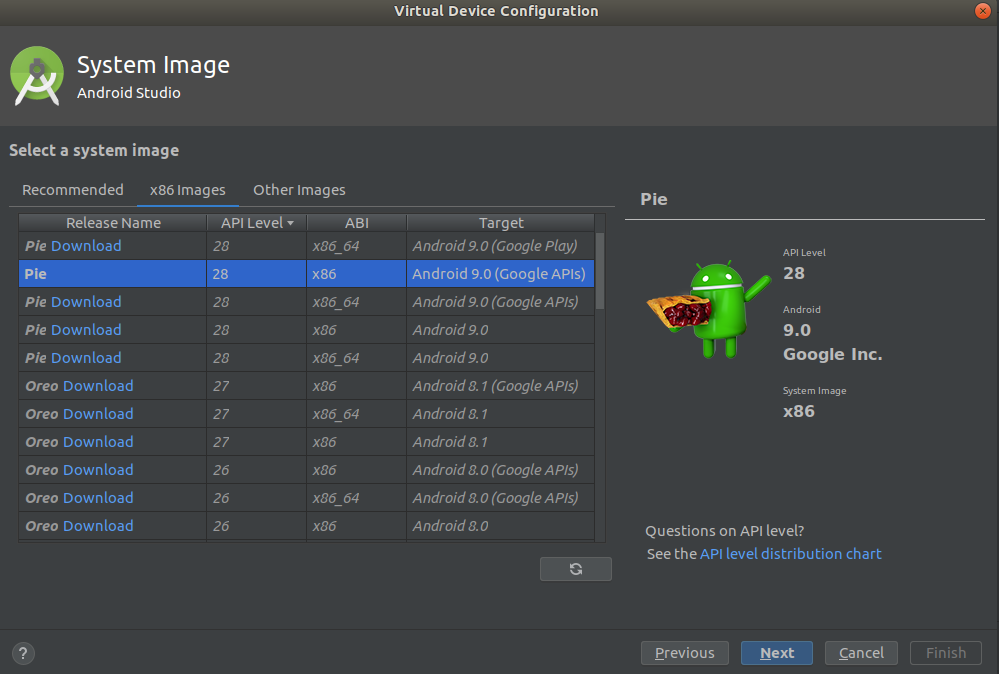

# Android Studio 3.3

Vamos a descargar el entorno de desarrollo que emplearemos a lo largo del curso

<https://developer.android.com/studio/>

Y pulsaremos sobre el botón *DOWNLOAD ANDROID STUDIO* para bajarnos el instalador.

Descomprime el zip descargado, será similar a `android-studio-ide-XXX.XXXXXXX-SISTEMAOPERATIVO.zip`

En el caso de Windows ejecuta el instalador, en MacOS mueve la aplicación a la carpeta de aplicaciones y en el caso de Linux accede a la carpeta "{installation home}/bin" y lanza el siguiente comando:

&nbsp;&nbsp;&nbsp;`sh ./studio.sh`

Abrir la aplicación y seguir los pasos que indica el asistente. Posteriormente pasaremos a crear un nuevo emulador donde ejecutaremos nuestras apps.

# Crear un nuevo emulador

Vamos a crear un nuevo proyecto, es indiferente el tipo, poara posteriormente crear un nuevo emulador.

En la barra de herramientas:


Haremos clic sobre el botón de AVD:


Se nos abrirá una nueva vista y haremos clic sobre el botón *create virtual device...*


Entonces se mostrará la vista que nos permite seleccionar el tipo de móvil, buscaremos el Nexus 5X (por ejemplo):


Tras buscarlo seleccionarlo y hacer clic sobre *Next*


A continuación seleccionaremos OS que le queremos dar al dispositivo:



Dar el nombre al dispositivo y seleccionar vertical para concluir pulsando el botón de *Finish*:


# Opcional: Ubuntu Users

Vamos a crear un acceso directo de Android Studio en el cajón de aplicaciones de Ubuntu:

Crear un TXT en ~/Escritorio
Cambia el nombre a "Android Studio.desktop"
Escribe `{installation home}/bin` donde `{installation home}` será el path completo a la instalación de Android Studio:

```
    [Desktop Entry]
    Name=Android Studio
    Comment=IDE Android
    Exec=nohup sh {installation home}/bin/studio.sh
    Icon={installation home}/bin/studio.png
    Terminal=false
    Type=Application
```

A continuación le concederems permisos, abre el terminal y cerciorate que estás en el home:

```
chmod 777 ~/Escritorio/Android Studio.desktop
```

Cierra el terminal y vamos a permitir la ejecución:

&nbsp;&nbsp;&nbsp;Botón derecho >> Permisos >> Marcar la opción de ejecución


Haz clic sobre el ejecutable que hemos creado, es decir sobre `~/Escritorio/Android Studio.desktop` y permite la ejecución. Con esto ya se permitirá lanzar Android Studio

Finalmente lanza el siguiente comando para añadir Android Studio al cajón de aplicaciones:

```
mv ~/Escritorio/Android Studio.desktop /usr/share/applications/
```
