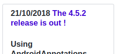
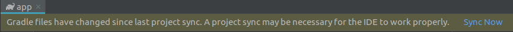
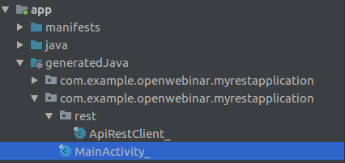

# Instalando AndroidAnnotations

Lanza Android Studio e inicia un nuevo proyecto.

Crea un nuevo proyecto con esta información:

&nbsp;&nbsp;&nbsp;- Application name: InstallingAndroidAnnFramework

&nbsp;&nbsp;&nbsp;- Company domain: openwebinar.example.com

&nbsp;&nbsp;&nbsp;- Project location: [tu propio path]

Y pulsaremos sobre el botón de *Next*, se abrirá una nueva vista (Target Android Devices) que deberemos poner:

&nbsp;&nbsp;&nbsp;- Phone and Tablet: API 26: Android 8.0 (Oreo)

Y pulsaremos sobre el botón de *Next*, se abrirá una nueva vista (Add an Activity to Mobile) y seleccionamos:

&nbsp;&nbsp;&nbsp;- Empty Activity

Y pulsaremos sobre el botón de *Next*, se abrirá una nueva vista (Configure Activity):

&nbsp;&nbsp;&nbsp;- Activity Name: MainActivity

&nbsp;&nbsp;&nbsp;- Layour Name: activity_main

Y pulsamos el botón de *Finish*.

# Configuración de AndroidAnnotations

A continuación configuraremos AndroidAnnotations (AA).

Podemos ver los pasos a seguir en el siguiente enlace, en la sección de *[Gradle](https://github.com/androidannotations/androidannotations/wiki/Configuration#gradle)*.

<https://github.com/androidannotations/androidannotations/wiki/Configuration>

### (1) Añade las dependencias de AA

La docuentación la podremos ver en:

<https://github.com/androidannotations/androidannotations/wiki/Building-Project-Gradle>

&nbsp;&nbsp;&nbsp; Abre: `<path_to_your_project>/<app_name>/build.gradle`

&nbsp;&nbsp;&nbsp; Añade (donde `XXX` será la última versión, la versión se puede ver [en este enlace](https://github.com/androidannotations/androidannotations/wiki/Building-Project-Gradle) pero se para el caso de la imagen será `4.5.2`)



```
		def AAVersion = 'XXX'
		dependencies {
		    annotationProcessor "org.androidannotations:androidannotations:$AAVersion"
		    compile "org.androidannotations:androidannotations-api:$AAVersion"
		}
```

&nbsp;&nbsp;&nbsp; A continuación deberás hacer el build de la app (doble clic en): `Gradle > (root) > Tasks > Build > build`

&nbsp;&nbsp;&nbsp; Con la información que nos facilita AA se produce un error:

```
	    Configuration 'compile' is obsolete and has been replaced with 'implementation' and 'api'.
	    It will be removed at the end of 2018. For more information see: http://d.android.com/r/tools/update-dependency-configurations.html
```

&nbsp;&nbsp;&nbsp; Por lo que deberemos cambiar de *"compile"* a **"implementation"**:

```
	    annotationProcessor "org.androidannotations:androidannotations:$AAVersion"
	    implementation "org.androidannotations:androidannotations-api:$AAVersion"
```

### (2) Importar las dependencias de AndroidAnnotations


&nbsp;&nbsp;&nbsp; Haz clic en *Sync now*:



También podemos seguir los pasos del siguiente enlace:

```
		Gradel > (app) > Tasks > build > build
		Wait to: "BUILD SUCCESSFUL in XXs"
```

O seguiremos:

<https://github.com/androidannotations/androidannotations/wiki/Gradle-IntelliJ>

### (3) Valida la funcionalidad de AndroidAnnotations

A continuación veremos nuestra primera clase de ejemplo:

<https://github.com/androidannotations/androidannotations/wiki/FirstActivity>

vamos a probarlo por nosotros mismos:

&nbsp;&nbsp;&nbsp; Añade la anotación "@EActivity(R.layout.activity_main)"

&nbsp;&nbsp;&nbsp; Y comenta la linea "setContentView(R.layout.activity_main);"

&nbsp;&nbsp;&nbsp; A continuación `Build > Make project` o pulsa ctrl+F9.

&nbsp;&nbsp;&nbsp;&nbsp;&nbsp;&nbsp; Esto generará el siguiente error:

```
			error: The AndroidManifest.xml file contains the original component, and not the AndroidAnnotations generated component. Please register MainActivity_ instead of MainActivity
```

&nbsp;&nbsp;&nbsp; Para solucionar el error, abriremos `src/main/AndroidManifest.xml`

&nbsp;&nbsp;&nbsp; Cambia:
```
			<!-- android:name=".MainActivity_" -->
			<!-- This MUST have the '_' you cannot work with the  '.MainActivity'-->
			<activity
			    android:name=".MainActivity_"
			    android:label="@string/app_name"
			    android:theme="@style/AppTheme.NoActionBar">
			    <intent-filter>
				<action android:name="android.intent.action.MAIN" />

				<category android:name="android.intent.category.LAUNCHER" />
			    </intent-filter>
			</activity>
```

### (4) Última validación

Si la configuración la hemos realizado correctamente deberemos tener los siguientes nuevo paquetes:

```
		GeneratedJava > com.example.openwebinar.installingandroidannframework > MainActivity_
```

Vemoslo en el Android Studio:




### (5) Lanzar la app en el emulador

`Run` o `Mayús+F10`
