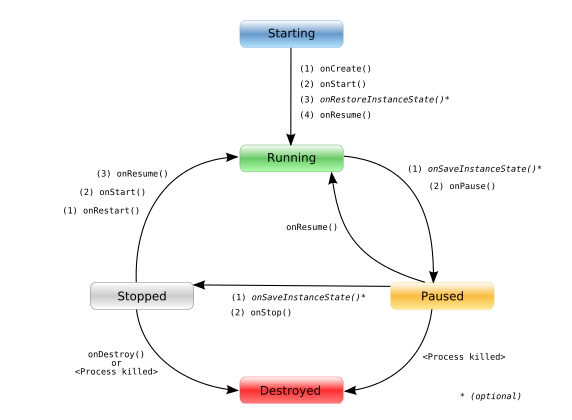
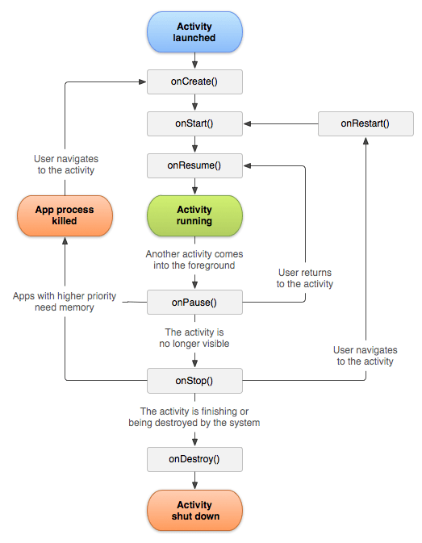

# Introducción

Una aplicación de Android está formada por un conjunto de **elementos básicos** en los que el usuario puede **interactuar**, se denominan **actividades**. Las actividades, como en el reino animal, pasan por fases a lo largo de su vida, *nacen*, *crecen*, se *reproducen* y *mueren*.


Una aplicación de Android se ejecuta dentro de su **propio proceso de Linux**. Este proceso se crea con la aplicación y **continuará** activo hasta que ya **no sea necesario**.

La destrucción del proceso no está controlada directamente por la aplicación, el **sistema determinará** cuándo **destruir** el proceso (por ejemplo, cuando se necesita memoria).

Si después de **eliminar** el proceso, el **usuario vuelve** a él, el proceso se **creará** nuevamente, pero el **estado** de esa aplicación se habría **perdido** (por ejemplo, los datos que el usuario ha insertado). En estos casos, será responsabilidad del programador almacenar el estado de las actividades, si queremos que cuando se reinicien, mantengan su estado.

La organización de las **actividades ya mostradas** se mantiene empleando una **pila**. Gracias a esto, el usuario puede volver a la actividad anterior presionando el botón de retorno.

**Android** es **sensible** al **ciclo de vida** de la actividad. Todas las actividades tienen estos estados de actividad:



```
	Estado	       Descripción
	--------------------------
	Running        La actividad es visible e interactúa con el usuario.
	Paused         La actividad sigue siendo visible pero se ha dejado de usar, la instancia se está ejecutando pero el sistema puede anularla.
	Stopped        La actividad no es visible, la instancia se está ejecutando, pero puede ser eliminada por el sistema.
	Killed         La actividad ha sido terminada por el sistema mediante una llamada a su método "finish()".
```


# Ciclo de vida Android

Cada vez que una actividad **cambia su estado**, se genera un **evento** y puede ser **capturado** por ciertos métodos de actividad:



### onCreate

<https://developer.android.com/reference/android/app/Activity.html#onCreate(android.os.Bundle)>

`protected void onCreate(Bundle savedInstanceState)`

Llamado cuando comienza la actividad. Aquí es donde debe ir la mayoría de las inicializaciones: llamar a `setContentView(int)` para inflar la UI de la actividad utilizando `findViewById(int)` para interactuar mediante programación con los widgets en la UI. Llamar a `managedQuery(android.net.Uri, String [], String, String [ ], String)` para recuperar los datos que se muestran, etc.


### onStart

<https://developer.android.com/reference/android/app/Activity.html#onStart()>

`protected void onStart()`

Se llama después de `onCreate(Bundle)` o después de `onRestart()` cuando la actividad se ha detenido. Será seguido por el método `onResume()`. Se ejecutará cuando la actividad se muestre al usuario.


### onResume

<https://developer.android.com/reference/android/app/Activity.html#onResume()>

`protected void onResume()`

Llamado después de `onRestoreInstanceState(Bundle)`, `onRestart()` o `onPause()`, para que su actividad comience a interactuar con el usuario. Éste es un buen lugar para lanzar animaciones, abrir elementos de acceso exclusivo (como la cámara), etc.

Tenga en cuenta que onResume no es el mejor indicador para garantizar que la actividad es visible para el usuario. Una ventana del sistema como el teclado puede estar en frente. Use `onWindowFocusChanged(booleano)` para saber con certeza que su actividad es visible para el usuario (por ejemplo, para reanudar un juego).


### onPause

<https://developer.android.com/reference/android/app/Activity.html#onPause()>

`protected void onPause()`

Llamado como parte del ciclo de vida de la actividad cuando una actividad está pasando a un segundo plano, pero aún no ha sido eliminada. La contraparte de `onResume()`.

Cuando la actividad B se inicie frente a la actividad A, ésta llamada se invocará en A. B no se creará hasta que A `onPause()` sea lanzado, así que asegúrese de no realizar ninguna operación larga aquí.

Ésta llamada se usa principalmente para guardar cualquier estado que se deba persistir en la actividad, para presentar un modelo de "edit in place" al usuario y asegurarse que no se pierda nada si no hay recursos suficientes para comenzar la nueva actividad sin matar primero a éste. Éste también es un buen lugar para hacer cosas como detener animaciones y otras cosas que consumen una cantidad considerable de CPU para hacer que el cambio a la siguiente actividad sea lo más rápido posible, o para cerrar recursos de acceso exclusivo como la cámara.


### onStop

<https://developer.android.com/reference/android/app/Activity.html#onStop()>

`protected void onStop()`

Llamado cuando la actividad ya no va a ser visible para el usuario. Entonces se irá `onRestart()`, `onDestroy()` o nada, dependiendo de la actividad posterior del usuario.


### onRestart

<https://developer.android.com/reference/android/app/Activity.html#onRestart()>

`protected void onRestart()`

Se llama después de `onStop()` cuando la actividad actual se muestra al usuario (el usuario ha vuelto a navegar). Le seguirán `onStart()` y luego `onResume()`.


### onDestroy

<https://developer.android.com/reference/android/app/Activity.html#onDestroy()>

`protected void onDestroy()`

Realice cualquier limpieza final antes de que se destruya una actividad. Esto puede suceder porque la actividad está terminando (alguien ha llamado `finish()`) o porque el sistema está destruyendo esta instancia de la actividad para ahorrar espacio. Puede distinguir entre estos dos escenarios con el método `isFinishing()`.

